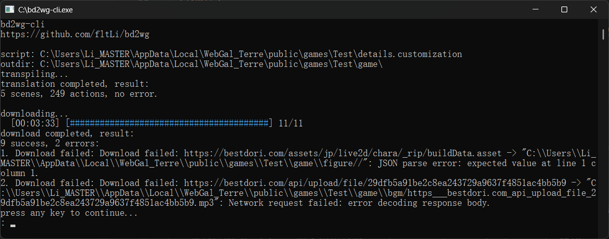
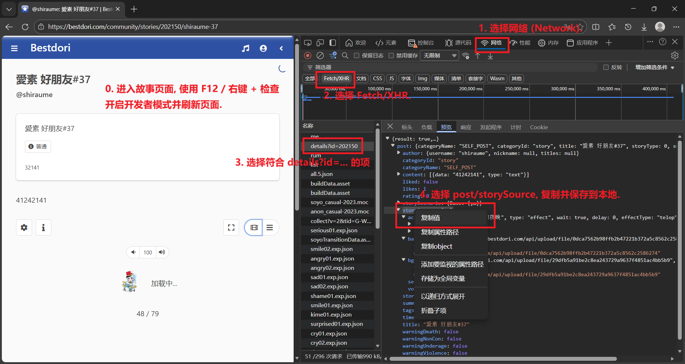

# bd2wg 使用说明

此文档涵盖了 bd2wg 的基本使用方式, 以及一些有助于更好使用的内容.

## 安装

前往[Releases 页面](https://github.com/fltLi/bd2wg/releases/latest)下载最新版本.

选择对应平台的包, 解压, 使用时直接运行 `bd2wg-cli.exe` 即可.

## 使用

上面这张截图展示了 bd2wg-cli 的全部使用流程.

运行程序后, 在 `story: ` 输入脚本路径, 在 `outdir: ` 输入导出位置即可开始执行.

> [!WARNING]
> 
> 若您不是在编辑界面取得脚本, 而是[爬取发布的故事](#爬取发布的故事)而来, 请只保留 `post/storySource` 下属的全部字段.  
> 一个合法的 Bestdori 脚本应由至少 `actions`, `bgm`, `background` 组成.
> 
> 对于导出路径 `outdir`, 请注意是否需要在尾部追加 `game/` 目录.  
> 导出位置将会生成 `scene`, `figure`, `background`, `bgm`, `vocal` 目录.
> 
> 导出将会覆盖重名内容, 请重点关注 `scene/start.txt`.

## 错误

程序运行时发生的错误会在每个流程完成后统一呈现.

由于转译的宽容性, 以及下载的重试操作, 基本不会发生致命错误.

请您一定要仔细阅读报错内容, 这将有助于您了解严重程度以及**处理方式**, 例如: 

- 若转译发生错误, 您可能只需要微调原脚本 / 生成的脚本.

- 若下载发生错误, 有可能是资源本身存在问题. 否则, 您可以根据 url 和写入路径手动下载.

## 拓展

### 爬取发布的故事

上面这张图展示了使用 Edge 开发者工具爬取已发布故事脚本的过程 (请注意框出的内容).
